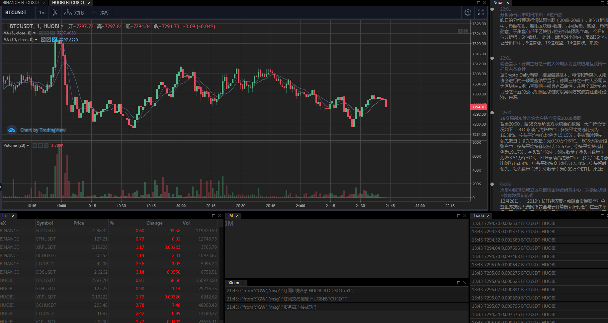

# Web

## 简介

前端比较简洁， 布局管理依赖 [Golden Layout](http://golden-layout.com/)； 图形展示依赖 [Trading View](https://www.tradingview.com/)

1. 左上行情窗口
2. 右上显示消息
3. 左下产品列表
4. 下中为一些链接状态 + IM(尚未开发)
5. 下右为交易记录

为啥没有采用Vue 或者 React？  尚未那么复杂？ 

## 参考 

1. [Golden Layout](http://golden-layout.com/)
2. [Trading View](https://www.tradingview.com/)
