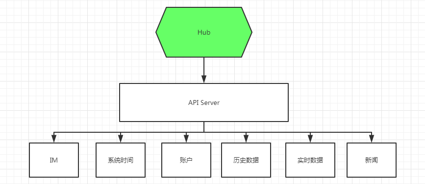

# API

## 简介



API 层是最终用户需要接触的部分， 内接Hub, 外接前端请求, 提供：

1. IM
2. 一些系统参数请求
3. 账户
4. 历史数据
5. 实时数据（WebSocket)
6. 新闻

## 详细

1. 基本HTTP 服务启动参考Spring 标准做法
2. 启动待容器启动后（com.gobtx.frontend.ws.config.WebSocketBootstrap）：
3. 启动 websocket 服务
4. 启动Hub 客户端 注册到所有的Hub 服务端


### WebSocket

走JSON消息类型， 服务端处理逻辑在：  **AcceptorWebSocketApplication**
消息模型在：  com.gobtx.common.web.model.request.RequestPacket:

1. requestId
2. path
3. parameters

**Path** 目前支持：

1. workshop  进入某个产品操作台， 自动监听K线和交易
2. heartbeat
3. subscribe 
4. unsubscribe
5. trade
6. unsubTrade

大部分按照字面理解


###  Pusher

推送逻辑， Hub 接收数据，通过 Pusher(MarketHubClientListener) 推送到客户监听端

解码成Json 通过 TextWebSocketFrame 推送便是。

这里通过 DisruptorPusher， 编码成Json 是直接放在 ByteBuf， 所以不同客户端使用同一个ByteBuf(retained 下)。

所以推送速度和压力只有带宽的限制，1个和100客户端代价基本一样。


### API 例子

#### 市场 list

#### K 线历史

#### Socket

**K线信息**

```
{
    "T": 1,
    "eX": "BINANCE",
    "I": "m1",
    "s": "BTCUSDT",
    "tK": 201911290540,
    "oT": 1575006000000,
    "cT": 1575006059999,
    "o": 7445.02,
    "h": 7446.31,
    "l": 7440,
    "c": 7443.44,
    "v": 24.690453,
    "a": 183739.34703303,
    "NOT": 290
}

```
**交易信息**

```
{
   "T": 2,
   "s": "BTCUSDT",
   "eX": "BINANCE",
   "rT": 1577156538415,
   "tT": 1577156538412,
   "p": 7329.97,
   "q": 0.178822,
   "BM": 0,
   "B": 0
}
```

