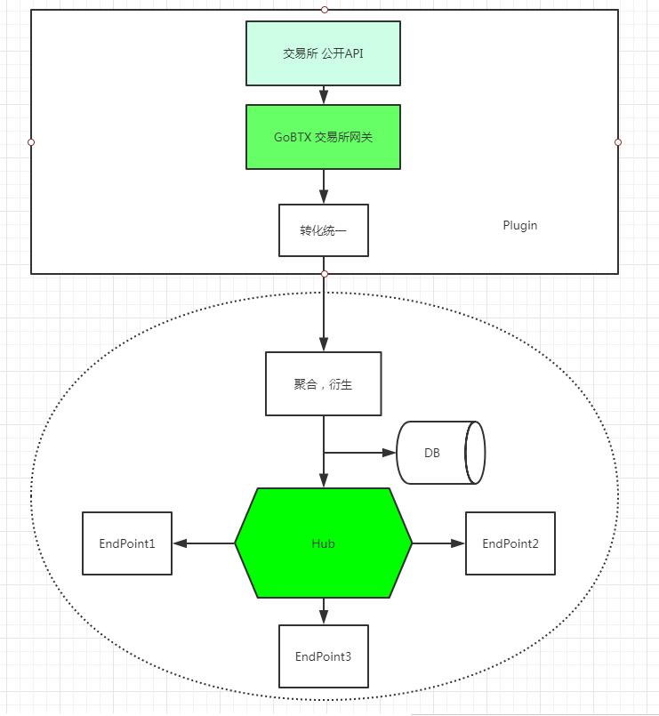

# Gateway

## 简介

所以这里的Gateway 包含两个：

1. 对接第三方交易所的gateway， 独立模块， 非独立服务， 必须集成到Xchange bootstrap 模块。
2. 内部的RPC Pub-Sub 提供内部信息分发的服务

## 外部网关

### xchange_common

包含：
1. 公用类
2. 聚合K线聚合， 每个交易所类型一样，部分自己运算出来
3. 落地实现
4. 缓存Hazlcast 通用
5. 部分接口类

### 对外网关实现

1. 通过API 接入数据
2. 统一转换， 发送给下游处理
3. 重试，出错处理

具体实现例子： **xchange_binance** 参考类 **com.gobtx.xchange.binance.BinanceMarketDataService**

**启动**

1. 上次抓取时间到当前的历史数据补充
2. 订阅价格和交易实时流

一些细节， 比如不同交易所可能， symbol  不太一致，需要转换统一。

## 聚合

从交易所采集的原始数据， 下游通过  MarketDataStreamListener 聚合， 再向下游分发。 
主要实现在 **com.gobtx.xchange.disruptor.DisruptorMarketStreamAggregator**

主要依赖 **[Disruptor](https://github.com/LMAX-Exchange/disruptor)** 做异步处理， 这里根据 Symbol (Normalized后的)， 做 segment;

所以将来有复杂的逻辑， 比如不同交易之间价格交叉比较， 预警等等可以在Disruptor 的 EventHandler 无缝的接下去， GoBTX handler（MarketEventHandler）:

1. 聚合生成新的K线
2. 落地
3. 分发给下游(通过Hub)

 

## Hub

每个交易所的 plugin 不提供独立服务， 必须集成到一个 Hub 也就是 Xchange 模块才能提供服务， 这部分是动态的。
你可以随意选择编撰哪些 交易所的 服务到一个 Hub 服务上面， 通过这个Hub 往下游提供服务， 这个Hub 负责：

1. 启动各个交易所 plugin 以及生命周期管理
2. 聚合后数据的分发
3. 对更下游（对外网关） 提供服务（通过 Netty)
 
具体实现参考  **com.gobtx.xchange.Bootstrap** 对整个生命周期的管理：

1. Spring 容器准备好后：
2. 此Hub 需要支持的交易所（Exchange)
3. 启动disruptor 聚合
4. 启动各个交易所网关
5. 都启动后启动 Hub 服务 #startHubServer

### Netty

聚合好的各种市场、交易信息，通过Hub 往下游模块提供数据传输服务， 这里提供一个简单的 Pub-Sub 模式实现（非Rpc)

服务端Hub 实现参考  **com.gobtx.hub.bootstrap.HubServerBootstrap**

etty 分包没有使用默认的 LengthFieldBasedFrameDecoder  用了PB Netty 里面的实现：

ProtobufVarint32FrameDecoder + ProtobufVarint32LengthFieldPrepender

至于 Codec 非常简单：
1. 第一字节包含消息类型
2. 具体的payload 只有两个：
   1. MKT_DATA(1)
   2. TRADE_DATA(2)
   
#### 编码

硬手工写了，没有用啥PB什么的， 参考实现 **com.gobtx.hub.protocol.CodecHelper**

基本就连个数据类型：
1.  TradeEventData
2.  OHLCData

注意 **BigDecimal** 有点点绕， 其他都很简单。

举个简单市场数据：

1. 1个字节（MKT_DATA(1)）
2. 1个字节（Exchange)
3. 1个字节（K 线类型)
4. 1个字节（Symbol 长度）
5. Symbol (动态长度)
6. 8个字节  开始时间
7. 8个字节  结束时间
8. 8个字节  交易数量
9. 8个字节  OHLC key
10. BigDecimal Open
11. BigDecimal High
12. BigDecimal Low
13. BigDecimal Close
14. BigDecimal Amount
15. BigDecimal Volume

**服务注册发现**  暂时没有， 硬编码吧。 所以整个 **Gateway** 暴露给下游的：

1. 一个 Pub-Sub 接口
2. 一个历史数据查询接口， 通过 Hazlcast 暴露给下游， 参考 **com.gobtx.xchange.configuration.HazelcastRepositoryConfiguration**

---

每个Xchange(Hub) 作为一个独立的应用，启动后是完全自包含的， 不需要任何模块 、上下游服务依赖， 这样管理上来说更方便。
作为内部服务， 不暴露公开访问
访问这里核心服务， 需要通过外围的API 下面将讲到

## 参考

1. [Disruptor](https://github.com/LMAX-Exchange/disruptor)
