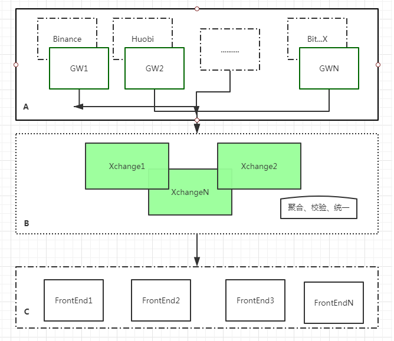

# Infrastructure

## 简介





整体结构图，如上文， 非常清晰简单， 由于我们这里不涉及，交易和账号部分。
存粹的市场数据， 所以在事务方面没有限制，给整个架构带来很多编辑，可以做到完全无状态


## 模块

```

├── common
├── model
├── ws_server

├── xchange
├── xchange_hub
├── xchange_common
├── xchange_binance
├── xchange_huobi
├── xchange_bybit(尚未实现)
└── xchange_okcoin(尚未实现)

├── binance-java-api（Binance Java SDK)
├── huobi-java-api（Huobi Java SDK)


├── xchange_24statistic
├── xchange_frontend(Web UI)

```

项目模块分类如上图演示：

1. 帮助类， 公用模块放在common 和 model 中
2. ws_server 提供 API + Websocket 服务 
3. 交易所相关的模块以 **xchange** 开头
   1. xchange_common 公共模型服务
   2. xchange xchange 服务启动bootstrap 模块，入口模块
   3. xchange_hub 一个简单的Pub-Sub Netty 实现，具体下面详细描述
   4. xchange_24statistic 24 小时交易统计
   5. xchange_{交易所} 各个交易所网关接口实现模块
4. xchange_frontend 前端WEB GUI
5. 各自的交易所JAVA SDK 可以直接到LIB 中引用， 也可以把代码fork 到这里， 也可以参考 [Xchange](https://github.com/knowm/XChange.git) 实现
 

## 服务

### xchange 

包含

1. 每个交易所网关实现
2. xchange 入口

每个网关实现： **com.gobtx.xchange.service.MarketDataService** 通过Spring context 注入到环境中包含：

1. 生命周期管理 start/stop 
2. add-hoc 历史市场数据查询 Stream<OHLCData> history
3. 只是数据类型  Set<KlineInterval> supportKlineIntervals
4. 支持下游消息监听注册
   1. Closeable listener(final MarketDataStreamListener listener);
   2. Closeable tradeListener(final TradeDataStreamListener listener);
   
   
Xchange 组织编排这些服务， 对内提供RPC接口，给下游模块消费, 实现细节在下文描述。 

 

### API

1. 提供 http API 服务
2. 提供 websocket SUB/UNSUB 服务
3. 通过XChange Hub 连接到内部Xchange 服务


